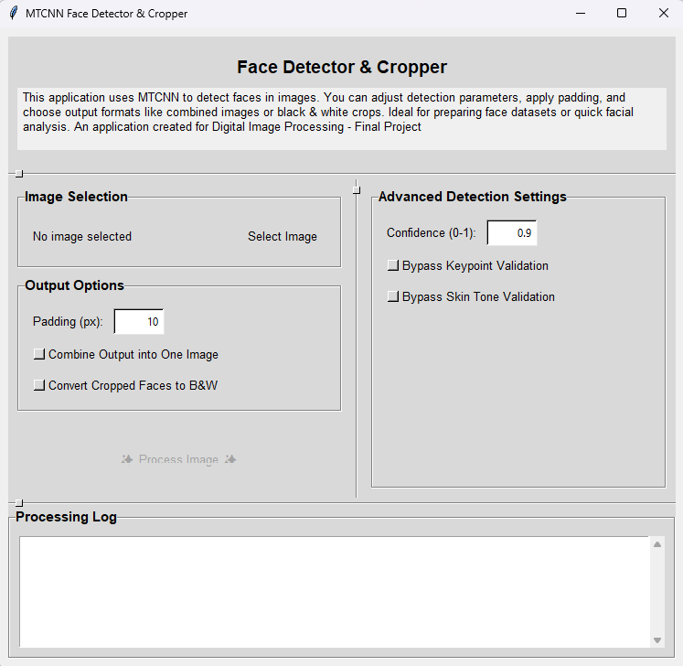

# Face Detector & Cropper GUI

A Python application with a Tkinter GUI to detect faces in images using MTCNN,
apply various filters and options (padding, combine output, B&W),
and save the cropped faces. Allows adjustment of detection confidence and
bypassing of keypoint/skin-tone validation for flexibility.

 <!-- Optional: Add a screenshot -->

## Features

*   Detects multiple faces in an image using MTCNN.
*   Provides options for:
    *   Adding padding around detected faces.
    *   Combining all detected faces into a single output image.
    *   Converting cropped faces to Black & White.
    *   Adjusting the MTCNN confidence threshold.
    *   Bypassing keypoint validation.
    *   Bypassing skin-tone validation.
*   User-friendly Tkinter GUI.
*   Logs processing steps.

## Prerequisites

*   Python 3.7+
*   `pip` (Python package installer)

## Setup & Installation

1.  **Clone the repository:**
    ```bash
    git clone https://github.com/YOUR_USERNAME/face-cropper-gui.git
    cd face-cropper-gui
    ```

2.  **Create and activate a virtual environment (recommended):**
    ```bash
    python -m venv venv
    # On Windows:
    # venv\Scripts\activate
    # On macOS/Linux:
    # source venv/bin/activate
    ```

3.  **Install dependencies:**
    ```bash
    pip install -r requirements.txt
    ```
    *(Note: MTCNN will download model files on its first run, which may take a moment.)*

## Usage

1.  **Run the application:**
    ```bash
    python face_cropper_gui.py
    ```
2.  Click "Select Image" to choose an image file.
3.  Adjust the padding, output options, and advanced/debug settings as needed.
4.  Click "Process Image".
5.  Cropped faces will be saved in the same directory as the input image.
    *   Individually: `imagename_face_1.jpg`, etc.
    *   Combined: `imagename_combined.jpg`
6.  Check the log area for processing details and any errors.

## Making a Standalone Executable (Optional)

If you want to create a standalone executable that doesn't require users to have Python or install dependencies manually, you can use PyInstaller.

1.  **Install PyInstaller (if you haven't already, preferably in your virtual environment):**
    ```bash
    pip install pyinstaller
    ```

2.  **Build the executable:**
    Navigate to your project directory in the terminal and run:
    ```bash
    pyinstaller --onefile --windowed --name FaceCropperApp face_cropper_gui.py
    ```
    *   `--onefile`: Bundles everything into a single executable file.
    *   `--windowed`: Prevents a command prompt window from appearing when the GUI app runs (use `-w` for short).
    *   `--name FaceCropperApp`: Sets the name of the executable.

    The executable will be created in a `dist` folder.

    **Important Notes for PyInstaller with MTCNN/TensorFlow:**
    *   TensorFlow and MTCNN can be large. The resulting executable might be quite big.
    *   MTCNN downloads its models dynamically. PyInstaller *should* bundle the `mtcnn` library, and the library itself will handle model downloads when the executable is run for the first time.
    *   If you encounter issues with TensorFlow (e.g., "failed to load Keras model"), you might need to explicitly include data files or use PyInstaller hooks, which can get complex. Test thoroughly.

## Troubleshooting

*   **MTCNN Initialization Error:** Ensure TensorFlow (or your chosen backend for MTCNN) is correctly installed. Check the console for detailed error messages when the script starts.
*   **"No faces detected":**
    *   Try lowering the "Confidence" threshold in the GUI.
    *   Try checking "Bypass Keypoints Req." and "Bypass Skin Tone Req."
    *   The image might genuinely not have faces MTCNN can easily detect.
*   **Large Executable Size:** This is common with PyInstaller, especially when libraries like TensorFlow are involved. `--onefile` also contributes to size.
